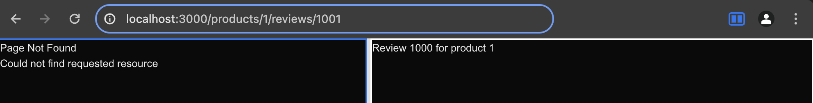
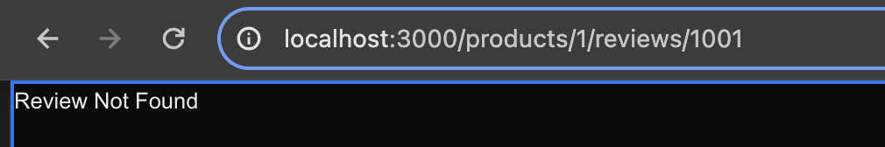

# Routing Demo project
> [Repo - Vishwas gopinav/Next.js-15-Tutorials](https://github.com/gopinav/Next.js-15-Tutorials/tree/main/routing-demo)

## [Lecture 05 - Routing](https://www.youtube.com/watch?v=9602Yzvd7ik&list=PLC3y8-rFHvwhIEc4I4YsRz5C7GOBnxSJY&index=5&pp=iAQB)

### 1. Create Routing-demo project
```bash
npx create-next-app@latest routing-demo
```

### 2. Configuration:
- TypeScript: No/**Yes**
- ESLint: No/**Yes**
- Tailwind: No/**Yes**
- src/ directory: No/**Yes**
- App Router: No/**Yes**
- Turbopack: **No**/Yes
- Alias **No**/Yes

### 3. Delete `app`` folder:
```
routing-demo/
├── node_modules/                       
│   └── ...
├── public/                       
│   └── ...
├── src/
├── .gitignore
├── eslint.cnfig.ts                
├── next.env.d.ts.ts                
├── next.config.ts                 
├── package-lock.json
├── package.json
├── postcss.config.mjs             
├── tailwind.config.js            
├── README.md            
└── tsconfig.json                 
```

### 4. Routing conventions:
1. All routes must live inside the app folder
2. route files must be named either  `page.js` or `page.tsx`.
3. Each folder represents a segment of the URL path.
> When these conventions are followed, the file automatically bcomes available as a route.

### 5. Scenarios:
#### Scenario 1:
1. localhost:3000/
```js
Home Page
```

#### Scenario 2:
1. localhost:/about:
```js
About Page
```
2. localhost:/profile:
```js
Profile Page
```

## [Lecture 06 - Nested Routes](https://www.youtube.com/watch?v=H7JjKjkC33c&list=PLC3y8-rFHvwhIEc4I4YsRz5C7GOBnxSJY&index=6&pp=iAQB)

### 1. Scenarios:
#### Scenario 3:
1. localhost:3000/blog
```js
My Blog
```
2. localhost:3000/blog/first
```js
First Blog page
```
3. localhost:3000/blog/second
```js
Second Blog page
```

## [Lecture 07 - Dynamic Routes](https://youtu.be/k9g6aVLH3p4?list=PLC3y8-rFHvwhIEc4I4YsRz5C7GOBnxSJY)

### 1. Scenarios:

#### Sceanrio 4:
1. localhost:3000/products
```js
Product 1
Product 2
Product 3
```

2. localost:3000/products/id
```js
Product Details
```

3. localost:3000/products/1
```js
Product 1 details
```

### 2. Code:
1. Products:
```js
/************* ./src/app/products/page.tsx *************/
export default function Products() {
  return (
    <>
      <h1>Products</h1>
      <h2>Product 1</h2>
      <h2>Product 2</h2>
      <h2>Product 3</h2>
    </>
  )
}
```
2. productId:
```js
/********** ./src/app/products/[productId]/page.tsx **********/
export default async function ProductDetails({
    params,
  }: {
    params: Promise<{ productId: string }>;
}) {
  const productId = (await params).productId;
  return <h1>Details about product {productId}</h1>;
}
```

### 3. Structure:
```
routing-demo/
├── node_modules/                       
│   └── ...
├── public/                       
│   └── ...
├── src/
│   └── app/
│       │── about/
│       │   └── page.tsx
│       │── blog/
│       │   └── page.tsx
│       │── products/
│       │   │── page.tsx
│       │   └── [productId]/
│       │        └── page.tsx
│       └── profile/
│           └── page.tsx
├── .gitignore
├── eslint.cnfig.ts                
├── next.env.d.ts.ts                
├── next.config.ts                 
├── package-lock.json
├── package.json
├── postcss.config.mjs             
├── tailwind.config.js            
├── README.md            
└── tsconfig.json   
```

## [Lecture 08 - Nested Dynamic Routes](https://youtu.be/edrJf0GKfAI?list=PLC3y8-rFHvwhIEc4I4YsRz5C7GOBnxSJY)

### Scenario 05:
1. localhost:3000/products/1/details
```js
Product 1 details
```

2. localhost:3000/products/1/reviews/1
```js
Review 1 for product 1
```

### Code:
```js
/***** ./src/app/products/[productId]/reviews/[reviewId]/page.tsx *****/
export default async function ReviewDetails({
    params,
  }: {
    params: Promise<{ productId: string; reviewId: string }>;
}) {
  const { productId, reviewId } = await params;
  return <h1>Review {reviewId} for product {productId}</h1>;
}
```

### Structure:
```
routing-demo/
├── node_modules/                       
│   └── ...
├── public/                       
│   └── ...
├── src/
│   └── app/
│       │── about/
│       │   └── page.tsx
│       │── blog/
│       │   └── page.tsx
│       │── products/
│       │   │── page.tsx
│       │   └── [productId]/
│       │        │── page.tsx
│       │        └── reviews/
│       │            └──[reviewId]/
│       │                └── page.tsx
│       └── profile/
│           └── page.tsx
├── .gitignore
├── eslint.cnfig.ts                
├── next.env.d.ts.ts                
├── next.config.ts                 
├── package-lock.json
├── package.json
├── postcss.config.mjs             
├── tailwind.config.js            
├── README.md            
└── tsconfig.json   
```

## [Lecture 09 - catch-all segments](https://youtu.be/d46hLIg1B3Q?list=PLC3y8-rFHvwhIEc4I4YsRz5C7GOBnxSJY)

### Scenario 06:
localhost:3000/docs/feature1/concept1
```js
Feature 1
  Concept 1
  Concept 2
  Concept 3
  Concept 4
  Concept 5
Feature 2
Feature 3
Feature 4
Feature 5
```

```js
Docs for F1 C1
```
### Estructura del Proyecto Next.js con App Router

```plaintext
routing-demo/
├── node_modules/                       # Dependencias de npm
│   └── ...
├── public/                             # Assets estáticos
│   └── ...
├── src/                                # Código fuente
│   └── app/
│       ├── about/                      
│       │   └── page.tsx                # Página `/about`
│       ├── blog/                       
│       │   ├── first/
│       │   │   └── page.tsx            # Página `/blog/first`
│       │   └── second/
│       │       └── page.tsx            # Página `/blog/second`
│       ├── docs/                       
│       │   ├── [[...slug]]/            # Ruta catch-all `/docs/*`
│       │   └── page.tsx                # Página dinámica de documentación
│       ├── products/                       
│       │    ├── [productId]/           # Ruta dinámica `/products/:id`
│       │    │    ├── reviews/          
│       │    |    │     ├── [reviewId]/ # Ruta anidada `/products/:id/reviews/:reviewId`
│       │    |    │     └── page.tsx    
│       │    |    └── page.tsx          # Página detalle de producto
│       │    └── page.tsx               # Listado de productos `/products`
│       ├── profile/                       
│       │   └── page.tsx                # Página `/profile`
│       ├── globals.css                 # Estilos globales
│       ├── layout.tsx                  # Layout principal
│       ├── not-found.tsx               # (*) Página 404 personalizada
│       └── page.tsx                    # Página Home `/`
├── .gitignore
├── eslint.config.ts                    # Configuración ESLint
├── next-env.d.ts                       # Tipos de Next.js
├── next.config.js                      # Configuración Next.js
├── package-lock.json
├── package.json
├── postcss.config.mjs                  # Configuración PostCSS
├── tailwind.config.js                  # Configuración Tailwind CSS
├── README.md            
└── tsconfig.json                       # Configuración TypeScript              
```


## [Lecture 10 - Page not Found](https://youtu.be/GCipVDqBD3k?list=PLC3y8-rFHvwhIEc4I4YsRz5C7GOBnxSJY)

### 1. add `./src/app/not-found.tsx` file:
- `not-found` component does not accept  props.
```plaintext
routing-demo/
├── node_modules/                       # Dependencias de npm
│   └── ...
├── public/                             # Assets estáticos
│   └── ...
├── src/                                # Código fuente
│   └── app/
│       ├── about/                      
│       │   └── page.tsx                # Página `/about`
│       ├── blog/                       
│       │   ├── first/
│       │   │   └── page.tsx            # Página `/blog/first`
│       │   └── second/
│       │       └── page.tsx            # Página `/blog/second`
│       ├── docs/                       
│       │   ├── [[...slug]]/            # Ruta catch-all `/docs/*`
│       │   └── page.tsx                # Página dinámica de documentación
│       ├── products/                       
│       │    ├── [productId]/           # Ruta dinámica `/products/:id`
│       │    │    ├── reviews/          
│       │    |    │     ├── [reviewId]/ # Ruta anidada `/products/:id/reviews/:reviewId`
│       │    |    │     └── page.tsx    
│       │    |    └── page.tsx          # Página detalle de producto
│       │    └── page.tsx               # Listado de productos `/products`
│       ├── profile/                       
│       │   └── page.tsx                # Página `/profile`
│       ├── globals.css                 # Estilos globales
│       ├── layout.tsx                  # Layout principal
│       ├── not-found.tsx               # (*) Página 404 personalizada
│       └── page.tsx                    # Página Home `/`
├── .gitignore
├── eslint.config.ts                    # Configuración ESLint
├── next-env.d.ts                       # Tipos de Next.js
├── next.config.js                      # Configuración Next.js
├── package-lock.json
├── package.json
├── postcss.config.mjs                  # Configuración PostCSS
├── tailwind.config.js                  # Configuración Tailwind CSS
├── README.md            
└── tsconfig.json                       # Configuración TypeScript
```

#### its code:
```tsx
export default function NotFound() {
    return (
        <div>
            <h2>Page Not Found</h2>
            <p>Could not find requested resource</p>
        </div>
    )
}
```

### 2. In case for review there's only less than 1000 reviews, add a restriction regarding not-found page:
```tsx
import { notFound } from "next/navigation"; // 👈🏽
export default async function ReviewDetails({
    params,
  }: {
    params: Promise<{ productId: string; reviewId: string }>;
}) {
  const { productId, reviewId } = await params;
  // There must be a restriction for the reviewId, if it's more than 1000, then it should return a not-found page
  if (parseInt(reviewId) > 1000) { // 👈🏽
    notFound(); // 👈🏽
  }
  return <h1>Review {reviewId} for product {productId}</h1>;
}
```


### 3. Customize the not-found page for restricted rule:
#### Code:
```tsx
export default function NotFound() {
    return (
        <div>
            <h2>Review Not Found</h2>
        </div>
    )
}
```

#### project structure:
```
├── src/                                # Código fuente
│   └── app/
│       ├── about/                      
│       │   └── page.tsx 
│       │   ... 
│       ├── products/                       
│       │    ├── [productId]/           # Ruta dinámica `/products/:id`
│       │    │    ├── reviews/          
│       │    |    │     ├── [reviewId]/        # Ruta anidada `/products/:id/reviews/:reviewId`
│       │    |    │     │    └── not-found.tsx # customized not found page for ReviewId  
│       │    |    │     └── page.tsx   
```

#### how it works:
 


### 4. Another way is using `pathname` and `use client` restriction:
```tsx
"use client";  // 👈🏽
import { usePathname } from "next/navigation";  // 👈🏽
export default function NotFound() {
  const pathname = usePathname(); // 👈🏽
  console.log("pathname: ", pathname); // 👈🏽
  console.log('pathname.split("/")[0]', pathname.split("/")[0]); // 👈🏽
  console.log('pathname.split("/")[1]', pathname.split("/")[1]); // 👈🏽
  console.log('pathname.split("/")[2]', pathname.split("/")[2]); // 👈🏽
  console.log('pathname.split("/")[3]', pathname.split("/")[3]); // 👈🏽
  console.log('pathname.split("/")[4]', pathname.split("/")[4]); // 👈🏽
  const productId = pathname.split("/")[2];
  const reviewId = pathname.split("/")[4];
  if(parseInt(reviewId) > 1000) {
    return (
      <div>
        <h2>Review Not Found</h2>
        <p>Review {reviewId} for product {productId} not found</p>
      </div>
    )
  }
}
```

## [Lecture 11 - ]()

## [Lecture 12  -]()

## [Lecture 13  -]()

## [Lecture 14  -]()


@RecursosCompartidos